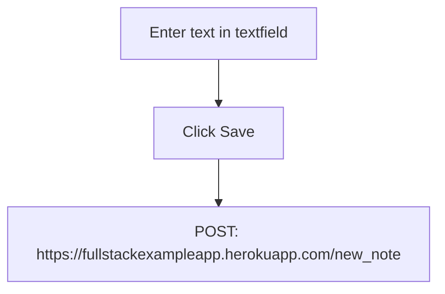

<!-- This mermaid diagram is for Exercise 0.4 -->

<!-- This mermaid diagram is for Exercise 0.5 and 0.6 -->
```mermaid
graph TD
    A[Browser] --> B["Server GET: h#8204;ttps://studies.cs.helsinki.fi/exampleapp/spa"]
    B --> C[Load HTML document]
    C --> D["Server GET: h#8204;ttps://studies.cs.helsinki.fi/exampleapp/main.css"]
    D --> E[Load Main CSS File]
    E --> F["Server GET: h#8204;ttps://studies.cs.helsinki.fi/exampleapp/spa.js"]
    F --> G["Server GET: h#8204;ttps://studies.cs.helsinki.fi/exampleapp/data.json"]
    G --> H[Enter text in Textfield]
    H --> I{Click Save}
    I --> |Clicked Save| B
 
